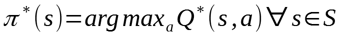

# Project 1: Navigation
Udacity Deep Reinforcement Learning Nanodegree

## Deep Q-Network Agent learning on a Unity environment

### Goal
The state space has 37 dimensions and contains the agent's velocity, along with ray-based perception of objects around agent's forward direction.  Given this information, the agent has to learn how to best select actions.  Four discrete actions are available, corresponding to:
- **`0`** - move forward.
- **`1`** - move backward.
- **`2`** - turn left.
- **`3`** - turn right.

The task is episodic, and in order to solve the environment, your agent must get an average score of +13 over 100 consecutive episodes.

### Learning Algorithm
The deep reinforcement learning algorithm implemted is the Deep Q-Network as described in this [paper](https://storage.googleapis.com/deepmind-media/dqn/DQNNaturePaper.pdf)
DQN is a special type of Q-learning algorithm it combines traditional Q-learning with deep neural networks.

Q-Learning agents use a policy to decide which action to chose to interact with an environment.
The environment provides a feedback to the agent given a state S and an action A which consists of a reward R and the next state S'.
The aim for the agent is to learn the optimal policy which maximizes the reward, the agent is able to learn through repeated interaction with the environment.

The algorithm, therefore, has a function that calculates the quality of a state-action combination:

The optimal policy is defined by chosing the action which maximizes the Q-function for any given state.

The action-value function is updated iteratively using the Bellman equation

*source: wikipedia*

This formula will maximize the q-function with respect to the actions and eventually make the Q table converge to the optimal policy
It also introduces some **hyperparameters**, namely the learning rate alpha and the discount factor gamma.

### Hyperparameters
We have already seen two hyperparameters introduced in the q-function.

The learning rate controls the speed at which the q-values are updated, a small alpha will make the learning slower but also less prone to non-convergence.

The discount factor controls the importance of future rewards. A well balanced gamma will help ensure that future rewards are taken into account in finding the optimal policy and prevent convergence to a suboptimal local optimum focused on short term reward only.

Another challenge of Q-learning is in chosing the next action, if an agent only ever choses the best currently known action given a state chances are the agent will not learn well the potential other actions may have. This is the exploration vs exploitation trade-off.

The algorithm implemented here also uses a 𝛆-greedy policy which allows chosing an action at random (exploration) with a probability of 𝛆 as opposed to the best currently known action (exploitation). The value of the 𝛆 is decayed over time to allow the algorithm to converge.

One last hyperparamter introduced in this implementation is the size the experience replay buffer.

### Experience Replay
We introduce an experience buffer in which we store the tuple of state, action, reward and next state. This has multiple benefits, some experiences may be rare of costly to reproduce.

We then sample randomly from this buffer to learn, which can allows the agent to learn from a given experience multiple times.
This helps prevent correlation between samples and ultimately prevent the action value from oscillating or diverging.

### Score

### Ideas for future work
The current implementation of DQN introduces experience replay as one known optimization of DQN.
Other optimizations could be introduced and tested: fixed q-target, double dqn, priorizited experience replay, dueling agents
