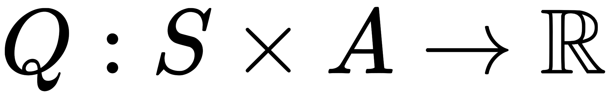
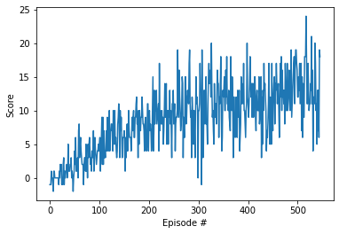

# Project 1: Navigation
Udacity Deep Reinforcement Learning Nanodegree

## Deep Q-Network Agent learning on a Unity environment

### Goal
The state space has 37 dimensions and contains the agent's velocity, along with ray-based perception of objects around agent's forward direction.  Given this information, the agent has to learn how to best select actions.  Four discrete actions are available, corresponding to:
- **`0`** - move forward.
- **`1`** - move backward.
- **`2`** - turn left.
- **`3`** - turn right.

The task is episodic, and in order to solve the environment, your agent must get an average score of +13 over 100 consecutive episodes.

### Learning Algorithm
The deep reinforcement learning algorithm implemted is the Deep Q-Network as described in this [paper](https://storage.googleapis.com/deepmind-media/dqn/DQNNaturePaper.pdf)
DQN is a special type of Q-learning algorithm it combines traditional Q-learning with deep neural networks.

Q-Learning agents use a policy to decide which action to chose to interact with an environment.
The environment provides a feedback to the agent given a state S and an action A which consists of a reward R and the next state S'.
The aim for the agent is to learn the optimal policy which maximizes the reward, the agent is able to learn through repeated interaction with the environment.

The algorithm, therefore, has a function that calculates the quality of a state-action combination:

### Score

### Ideas for future work
The current implementation of DQN introduces experience replay as one known optimization of DQN.
Other optimizations could be introduced and tested: double dqn, dueling agents
